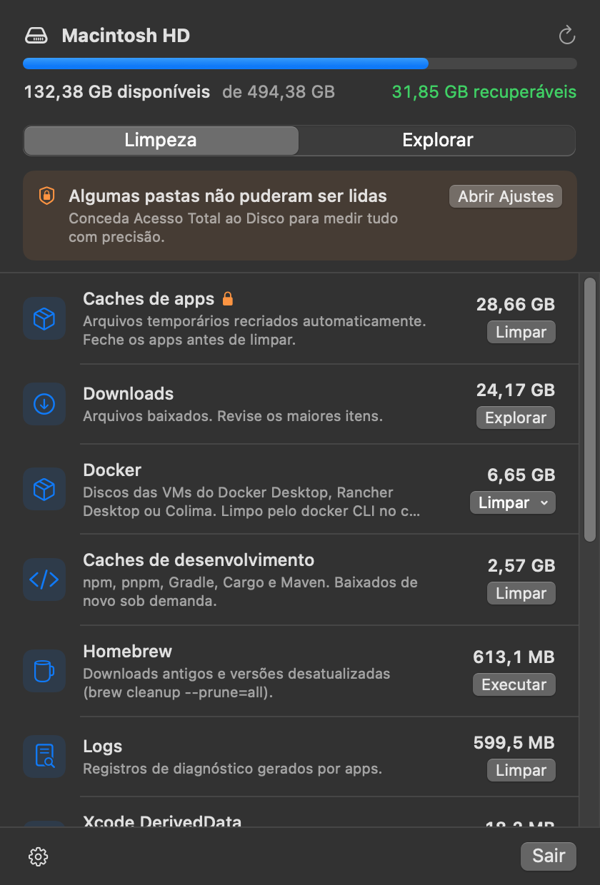

# Space Disk Free

A macOS menu bar app that shows where your disk space is going and cleans it up safely.

<p align="center">
  
</p>

- **Menu bar icon** with the free space on your disk. The icon switches to a warning above 90% usage.
- **Cleanup tab**: known space hogs, sorted by size, each with a one-click action that always asks for confirmation:
  - Trash, app caches, logs
  - Xcode: DerivedData, Device Support, Archives, unavailable simulators
  - npm, pnpm, Gradle, Cargo, Maven, Go
  - Android emulator system images
  - LM Studio models, one by one
  - Homebrew
  - Docker (Docker Desktop, Rancher Desktop, Colima), plus leftovers from an uninstalled Docker Desktop
  - iPhone/iPad backups and Downloads (review only)
- **Reclaimable total** in the header. Click its ⓘ to see which categories it adds up, which are left out and why.
- **Explore tab**: the largest folders in your home, the whole disk, or any folder you pick. You can drill down level by level, reveal items in Finder or move them to the Trash. Sizes are cached, so going back is instant.

Requires macOS 14 or later. Available in English and Brazilian Portuguese. The app follows the system language, and you can also pick a language just for this app in *System Settings › General › Language & Region › Applications*.

## Install

With [Homebrew](https://brew.sh):

```sh
brew install --cask guilhermehrcosta/tap/space-disk-free
```

Or download `SpaceDiskFree-<version>.dmg` from **Releases**, open it and drag the app into **Applications**. The build is universal (Apple Silicon and Intel).

The app is not signed with a Developer ID, so macOS blocks the first launch. To allow it, try to open the app once, then go to **System Settings › Privacy & Security** and click **Open Anyway**. You can also run this in Terminal:

```sh
xattr -dr com.apple.quarantine "/Applications/Space Disk Free.app"
```

## Permissions

The app is not sandboxed, because it has to read your whole home folder. Without **Full Disk Access**, macOS blocks some folders (Mail, Safari, other apps' containers, `~/.Trash`). When that happens, the app shows a banner with a shortcut to *System Settings › Privacy & Security › Full Disk Access*. Restart the app after granting it.

## Safety

- `SafetyPolicy` refuses to touch your home folder, `~/Library`, Documents, Desktop, iCloud Drive (`Mobile Documents`), `Application Support`, `Containers` and similar folders. It also refuses anything outside your home folder, except apps in `/Applications`, which can only be moved to the Trash.
- Symlinks are resolved before deleting, so a link can't redirect a cleanup outside your home folder.
- Items removed from the Explore tab always go to the Trash.
- Docker, Go, Homebrew and simulators are cleaned with their own tools (`docker system prune`, `go clean`, `brew cleanup`, `xcrun simctl`) instead of deleting their files directly.

## Build from source

Requires Xcode.

```sh
make run       # build and open build/Space Disk Free.app
make install   # copy to /Applications and open
make dmg       # universal build/SpaceDiskFree-<version>.dmg
make test      # DiskCore tests (Swift Testing)
make lint      # swift format lint, same as CI
make format    # format the code
make icon      # redraw Resources/AppIcon.icns from Scripts/make-icon.swift
make strings   # sync Resources/Localizable.xcstrings with the strings in the code
```

The ad-hoc signature changes on every build, so macOS may ask for Full Disk Access again after rebuilding.

## Release

Create a GitHub release with a version tag (`X.Y.Z` or `vX.Y.Z`) and publish it. The [release workflow](.github/workflows/release.yml) runs the tests, builds the universal `.dmg` and attaches it to the release. For releases that aren't marked as pre-release, it then updates the cask in [guilhermehrcosta/homebrew-tap](https://github.com/guilhermehrcosta/homebrew-tap).

To republish an existing release to the tap, run the workflow manually with its tag:

```sh
gh workflow run release.yml -f tag=X.Y.Z
```

## Architecture

```
Sources/
  DiskCore/              UI-free logic, covered by tests
    SizeCalculator       allocated size via fts(3); no symlink following, no volume crossing, hard links counted once
    DirectorySizeCache   explorer size cache, kept consistent after deletes
    CleanupCategory      catalog of categories and their cleanup actions
    Cleaner              runs a cleanup and measures the reclaimed space
    SafetyPolicy         what can never be deleted, whatever the UI asks
    AndroidSDK           system images and which ones emulators still use
    LMStudio             downloaded models, from the folder set in LM Studio
    DirectoryLister      direct children of a folder, for the explorer
    VolumeStatus         disk capacity and free space
  SpaceDiskFree/         SwiftUI app (MenuBarExtra)
    AppState             category scans, confirmations, launch at login
    ExplorerModel        navigation and parallel folder measurement
    Views/
```

### Cleanup strategies

| Strategy         | Effect                                                  | Used by                                     |
|------------------|---------------------------------------------------------|---------------------------------------------|
| `deleteContents` | permanently deletes a folder's contents, keeps the folder | caches, logs, DerivedData, Device Support   |
| `deleteItems`    | deletes specific items inside the category's folders     | Android images, LM Studio models            |
| `trashContents`  | moves contents to the Trash (reversible)                 | Xcode Archives, Docker Desktop leftovers    |
| `emptyTrash`     | empties the Trash (through Finder without Full Disk Access) | Trash                                    |
| `command`        | runs the tool's own cleanup in a login shell             | `brew`, `simctl`, `docker`, `go`            |
| `review`         | nothing automatic, opens the folder in Explore           | Downloads, iPhone backups                   |
